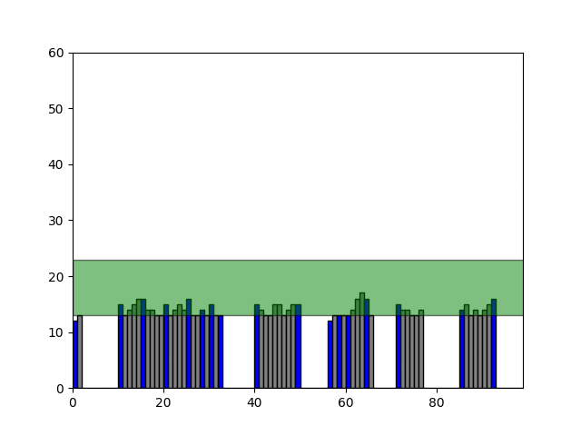

Flatland Diplodocus
===================

What is it?
-----------

A few days ago my little son was preparing for his first conference.
He wanted to tell about dinosaurs.
I think, that the part about dinosaurs extinction was most difficult to understanding him.
It looked like the meteorite killed them all at once, in one moment.

So, I'm tryed to show the basic principles of evolution: how descendants will be able to adapt to a new environment if it changes slowly, and what will happen otherwise.

I did take the [Abbot's](https://en.wikipedia.org/wiki/Edwin_Abbott_Abbott) world
( [flatland](https://en.wikipedia.org/wiki/Flatland) )
because it simple and cute.

Events take place in the wild forest.
There are a lot of diplodocus (`gray rectangle` - parents, `blue rectangle` - childs)
in this forest.
Diplodocus eats tree leaves (`green rectangle`).
So if trees is too high, no one be alive
If the height of the trees changes slowly (up or down), then subsequent generations of diplodocus will change in the same way.




Controls
--------

- **enter** - pause/resume epoch chanhing

- **up** - trees is slow growing up

- **shift** + **up** - trees is fast growing up

- **down** - trees is slow growing down

- **shift** + **down** - trees is fast growing down


Install
-------

```sh
pip3 install matplotlib

chmod +x ./flatland_diplodocus.py

./flatland_diplodocus.py
```
